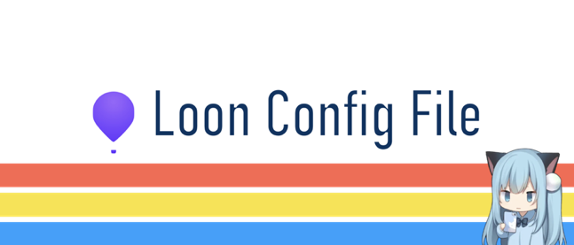

<div align="center">
  
</div>  

<div align="center">
  <h1>Loon 配置文件</h1>
</div>

## 📝 订阅链接

```
https://github.com/LinfengJang/proxy-config/raw/refs/heads/main/profiles/loon/Loon.lcf
```

## 🔧 使用方法

- 复制 **订阅链接** 
- 打开 **Loon**，**设置** —> **文件** —> **所有配置文件** —> **+ 按钮** —> **从链接导入**
- 长按导入的配置文件，在菜单中选择 **应用**


- 


- 

